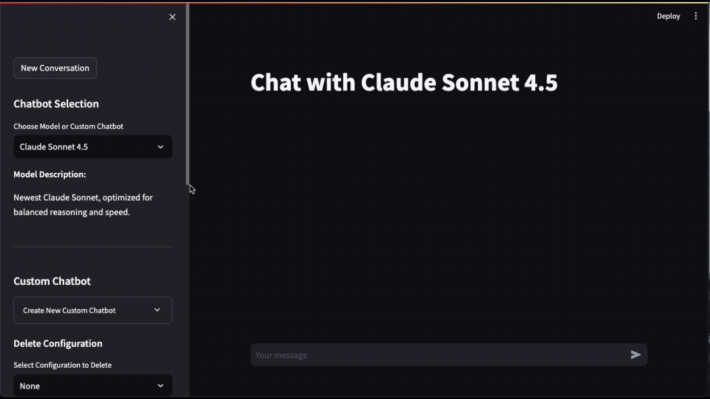
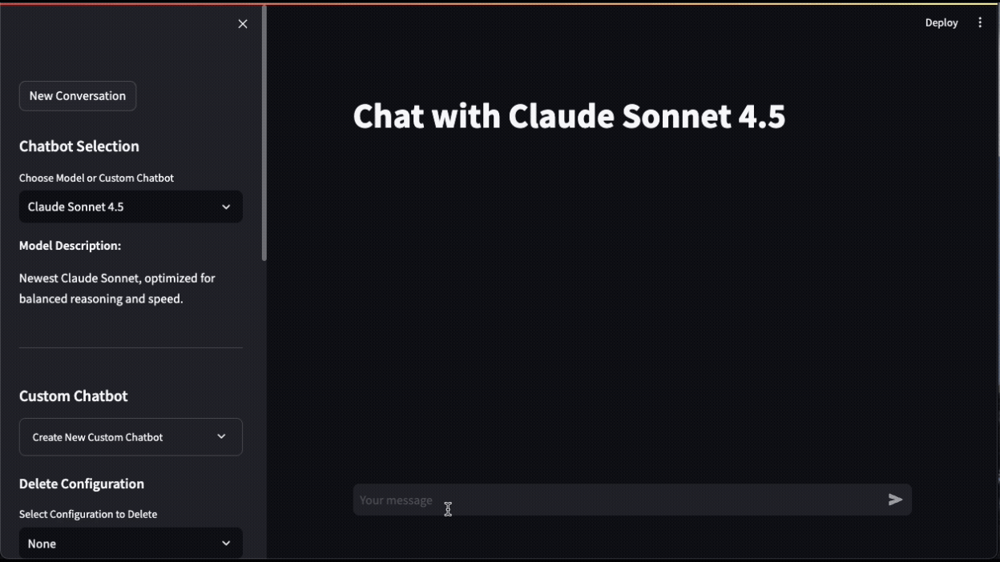
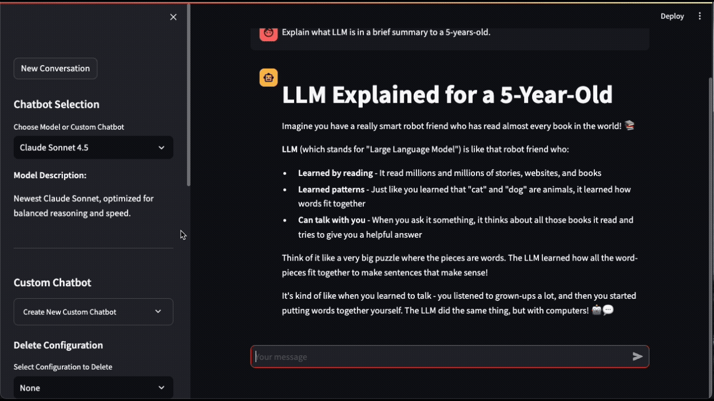
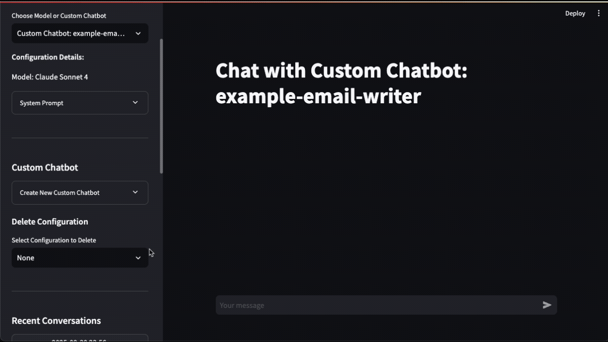

# simple-multi-model-chat
Portfolio project showcasing a simple multi-model chatbot. Chat with LLMs from OpenAI (GPT), Anthropic (Claude), DeepSeek, and Google (Gemini). Includes both a terminal interface and a Streamlit web app, with options for custom bots and local chat history.

## Key Features
- **Chatbot with selected model**: Use chat from various model selection from the dropdown in the sidebar: select from Claude and OpenAI models. You can see available model options on `utils.py`

    

- **Simple chat interface**: User can type their questions and see model response.

    

- **Custom Chatbot**: Ability to create custom chatbot - you can save custom system prompts for some commonly tasks, similar to custom GPT feature. Default example provided for email write, based on your prompt, it will generate a email response. You can see available custom chatbot under `custom_configs` folder. You can create a new chatbot on the side bar or create a similar JSON file.

    

- **Locally Saved Historical Conversations**: All your conversations will be saved as JSON file under `conversations` folder. If the folder does not exist, it will auto create the folder. You can review your previous conversations, retrieve and continue the conversation, or manage the conversation history.

    


## How To 
1. Create a .env file, copy the content from `example_env.txt` and update it with your own API key
2. On Termal, create virtual environment

    ```bash
    python -m venv venv
    source venv/bin/activate  # On Windows: venv\Scripts\activate
    pip install -r requirements.txt
    ```

    Then run the app by

    ```bash
    streamlit run app.py
    ```

3. (OPTIONAL) if environment file is not loaded, you can export the API key

    ```bash
    export ANTHROPIC_API_KEY="your_api_key_here"
    export OPENAI_API_KEY="your_api_key_here"
    ```

## Additional Info
### How to get API key
You will need to have a valid account for the provider and purchase credit in order to use their LLM for the chat app
- OpenAI: https://platform.openai.com/api-keys
- Anthrophic: https://console.anthropic.com/
- Google: https://aistudio.google.com/

### How to check latest model available
- On `utils.py`, you can modify the available model list, model description, and configure the default model. With fast changing in GenAI, you can use the following to get the latest model list from OpenAI or Anthrophic.

```bash
curl https://api.anthropic.com/v1/models \
     --header "x-api-key: $ANTHROPIC_API_KEY" \
     --header "anthropic-version: 2023-06-01"
```

```bash
curl https://api.openai.com/v1/models \
  -H "Authorization: Bearer $OPENAI_API_KEY"
```